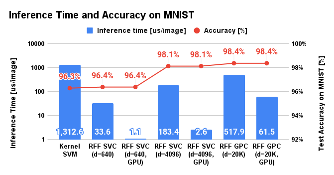

# Random Fourier Features

Python module of Random Fourier Features (RFF) for kernel method, like support vector classification [1], and Gaussian process.
Features of this RFF module are:

* interfaces of the module are quite close to the scikit-learn,
* support vector classifier and Gaussian process regressor/classifier provides CPU/GPU training and inference.
* this repository provides example code that shows RFF is useful for actual machine learning tasks.

Now, this module supports

* canonical correlation analysis (`rfflearn.cpu.RFFCCA`).
* Gaussian process regression (`rfflearn.cpu.RFFGPR`,`rfflearn.gpu.RFFGPR`)
* Gaussian process classification (`rfflearn.cpu.RFFGPC`,`rfflearn.gpu.RFFGPC`)
* principal component analysis (`rfflearn.cpu.RFFPCA`).
* regression (`rfflearn.cpu.RFFRegression`),
* support vector classification (`rfflearn.cpu.RFFSVC`, `rfflearn.gpu.RFFSVC`),
* support vector regression (`rfflearn.cpu.RFFSVR`),

RFF can be applicable for many other machine learning algorithms, I will provide other functions soon.


## Requirements and installations

See [this document](https://tiskw.gitbook.io/rfflearn/) for more details.


## Minimal example

Interfaces provided by our module is quite close to Scikit-learn.
For example, the following Python code is a sample usage of RFF regression class:

```python
>>> import numpy as np
>>> import rfflearn.cpu as rfflearn                     # Import our module
>>> X = np.array([[-1, -1], [-2, -1], [1, 1], [2, 1]])  # Define input data
>>> y = np.array([1, 1, 2, 2])                          # Defile label data
>>> svc = rfflearn.RFFSVC().fit(X, y)                   # Training
>>> svc.score(X, y)                                     # Inference (on CPU)
1.0
>>> svc.predict(np.array([[-0.8, -1]]))
array([1])
```

Also, you are able to run the inference on GPU by adding only two lines, if you have Tensorflow 2.x.

```python
>>> import rfflearn.gpu as rfflearn_gpu # Import our module
>>> svc = rfflearn_gpu.RFFSVC(svc)      # Convert to GPU model
>>> svc.score(X, y)                     # Inference on GPU
1.0
```

See [examples](./examples/README.md) directory for more detailed examples.


## MNIST using RFF and SVM

I applied SVM with RFF to MNIST which is a famous benchmark dataset for the classification task,
and I've got better performance and much faster inference speed than kernel SVM.
The following table gives a brief comparison of kernel SVM and SVM with RFF.
See the example of [RFF SVC module](./examples/svc_for_mnist/README.md)
and [RFF GP module](./examples/gpc_for_mnist/README.md) for mode details.

| Method         | RFF dimension | Inference time (us) | Score (%) |
|:--------------:|:-------------:|:-------------------:|:---------:|
| Kernel SVM     | -             | 4644.9 us           | 96.3 %    |
| RFF SVC        |  512          | 39.0 us             | 96.5 %    |
| RFF SVC        | 1024          | 96.1 us             | 97.5 %    |
| RFF SVC (GPU)  | 1024          | 2.38 us             | 97.5 %    |
| RFF GPC        | 5120          | 342.1 us            | 98.2 %    |
| RFF GPC (GPU)  | 5120          | 115.0 us            | 98.2 %    |

<div align="center">
  
</div>


## Notes

- Name of this module is changed to `rfflearn` on Oct 2020, because the same name as the previous name (PyRFF) already exists in PyPI.
- If a number of training data are huge, error message like
  `RuntimeError: The task could not be sent to the workers as it is too large for 'send_bytes'`.
  will be raised from the joblib library. The reason for this error is that sklearn.svm.LinearSVC uses
  joblib as a multiprocessing backend, but joblib cannot deal huge size of the array which cannot be managed
  with 32-bit address space. In this case, please try `n_jobs = 1` option for `RFFSVC` or `ORFSVC` function.
  Default settings are `n_jobs = -1` which means automatically detect available CPUs and use them.
  (This bug information was reported by Mr. Katsuya Terahata @ Toyota Research Institute Advanced Development.
  Thank you so much for the reporting!)


## TODO

- [ ] New function: implementation of batch RFF GP (but my GPU is poor to do that...)
- [ ] New function: implementation of RFF Logistic GP
- [X] Refactoring: modularization


## Licence

[MIT Licence](https://opensource.org/licenses/mit-license.php)


## Reference

[1] A. Rahimi and B. Recht, "Random Features for Large-Scale Kernel Machines", NIPS, 2007.
[PDF](https://papers.nips.cc/paper/3182-random-features-for-large-scale-kernel-machines.pdf)

[2] F. X. Yu, A. T. Suresh, K. Choromanski, D. Holtmann-Rice and S. Kumar, "Orthogonal Random Features", NIPS, 2016.
[PDF](https://papers.nips.cc/paper/6246-orthogonal-random-features.pdf)


## Author

Tetsuya Ishikawa ([EMail](mailto:tiskw111@gmail.com), [Website](https://tiskw.gitlab.io/home/))
