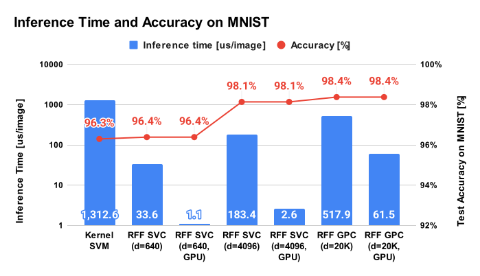
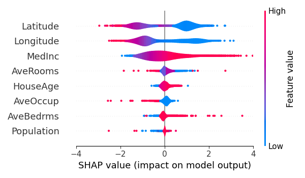
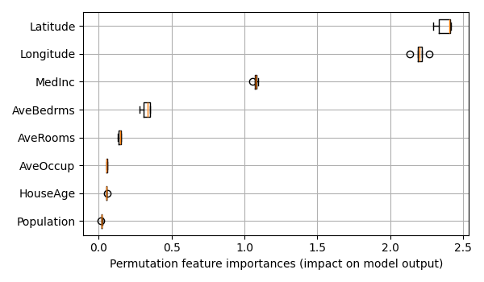

<div align="center">
  
</div>

<div align="center">
  
  &nbsp;
  
  &nbsp;
  
  &nbsp;
  
</div>


Random Fourier Features
====================================================================================================

This repository provides the Python module `rfflearn` which is a Python library of random Fourier
features (hereinafter abbreviated as RFF) [1, 2] for kernel methods, like support vector
machine [3, 4] and Gaussian process model [5]. Features of this module are:

- **User-friendly interfaces**: Interfaces of the `rfflearn` module are quite close to
  the [scikit-learn](https://scikit-learn.org/) library,
- **Example code first**: This repository provides plenty of [example code](./examples/) to
  demonstrate that RFF is useful for actual machine learning tasks,
- **GPU support**: Some classes in the `rfflearn` module provides both GPU training and inference
  for faster computation,
- **Wrapper to the other library**: Interface to [optuna](https://optuna.org/) and
  [SHAP](https://github.com/slundberg/shap) are provided for easier hyperparameter tuning and
  feature importance analysis.

Now, this module supports the following methods:

| Method                          | CPU support                  | GPU support           |
| ------------------------------- | ---------------------------- | --------------------- |
| canonical correlation analysis  | `rfflearn.cpu.RFFCCA`        | -                     |
| Gaussian process regression     | `rfflearn.cpu.RFFGPR`        | `rfflearn.gpu.RFFGPR` |
| Gaussian process classification | `rfflearn.cpu.RFFGPC`        | `rfflearn.gpu.RFFGPC` |
| principal component analysis    | `rfflearn.cpu.RFFPCA`        | `rfflearn.gpu.RFFPCA` |
| regression                      | `rfflearn.cpu.RFFRegression` | -                     |
| support vector classification   | `rfflearn.cpu.RFFSVC`        | `rfflearn.gpu.RFFSVC` |
| support vector regression       | `rfflearn.cpu.RFFSVR`        | -                     |

RFF can be applicable to many other machine learning algorithms than the above.
The author will provide implementations of the other algorithms soon.

**NOTE**: The author confirmed that the `rfflearn` module works on PyTorch 2.0! :tada:


Installation
----------------------------------------------------------------------------------------------------

Please install from PyPI.

```shell
pip install rfflearn
```

If you need GPU support, Optuna support or SHAP support,
you need to install the following packages.

```shell
# For GPU support.
pip install torch

# For Optuna support.
pip install optuna

# For SHAP support.
pip install matplotlib shap
```

The author recommends using [venv](https://docs.python.org/3/library/venv.html) or
[Docker](https://www.docker.com/) to avoid polluting your environment.


Minimal example
----------------------------------------------------------------------------------------------------

Interfaces provided by the module `rfflearn` are quite close to scikit-learn.
For example, the following Python code is a sample usage of `RFFSVC`
(support vector machine with random Fourier features) class.

```python
>>> import numpy as np
>>> import rfflearn.cpu as rfflearn                     # Import module
>>> X = np.array([[-1, -1], [-2, -1], [1, 1], [2, 1]])  # Define input data
>>> y = np.array([1, 1, 2, 2])                          # Defile label data
>>> svc = rfflearn.RFFSVC().fit(X, y)                   # Training (on CPU)
>>> svc.score(X, y)                                     # Inference (on CPU)
1.0
>>> svc.predict(np.array([[-0.8, -1]]))
array([1])
```

This module supports training/inference on GPU.
For example, the following Python code is a sample usage of `RFFGPC`
(Gaussian process classifier with random Fourier features) on GPU.
The following code requires PyTorch (>= 1.7.0).

```python
>>> import numpy as np
>>> import rfflearn.gpu as rfflearn                     # Import module
>>> X = np.array([[-1, -1], [-2, -1], [1, 1], [2, 1]])  # Define input data
>>> y = np.array([1, 1, 2, 2])                          # Defile label data
>>> gpc = rfflearn.RFFGPC().fit(X, y)                   # Training on GPU
>>> gpc.score(X, y)                                     # Inference on GPU
1.0
>>> gpc.predict(np.array([[-0.8, -1]]))
array([1])
```

See the [examples](./examples/) directory for more detailed examples.


Example1: MNIST using random Fourier features
----------------------------------------------------------------------------------------------------

The author tried SVC (support vector classifier) and GPC (Gaussian process classifier) with RFF to
the MNIST dataset which is one of the famous benchmark datasets on the image classification task,
and the author has got better performance and much faster inference speed than kernel SVM.
The following table gives a brief comparison of kernel SVM, SVM with RFF, and GPC with RFF. 
See the example of [RFF SVC module](./examples/svc_for_mnist/) and
[RFF GP module](./examples/gpc_for_mnist/) for more details.

| Method         | RFF dimension | Inference time [us/image] | Score [%] |
|:--------------:|:-------------:|:-------------------------:|:---------:|
| Kernel SVM     |      -        | 1312.6 us                 | 96.30 %   |
| RFF SVC        |    640        |   33.6 us                 | 96.39 %   |
| RFF SVC (GPU)  |    640        |   1.11 us                 | 96.39 %   |
| RFF SVC        |  4,096        |  183.4 us                 | 98.14 %   |
| RFF SVC (GPU)  |  4,096        |   2.62 us                 | 98.14 %   |
| RFF GPC        | 20,000        |  517.9 us                 | 98.38 %   |
| RFF GPC (GPU)  | 20,000        |  61.52 us                 | 98.38 %   |

<div align="center">
  
</div>


Example2: Visualization of feature importance
----------------------------------------------------------------------------------------------------

This module also has interfaces to some feature importance methods, like SHAP [6] and permutation
importance [7]. The author tried SHAP and permutation importance to `RFFGPR` trained on
the California housing dataset, and the followings are the visualization results obtained by
`rfflearn.shap_feature_importance` and `rfflearn.permutation_feature_importance`.

<div align="center">
  
  
</div>


Quick Tutorial
----------------------------------------------------------------------------------------------------

At first, please clone the `random-fourier-features` repository from GitHub:

```console
git clone https://github.com/tiskw/random-fourier-features.git
cd random-fourier-features
```

If you are using the docker image, enter into the docker container by the following command
(not necessary to run thw following if you don't use docker):

```console
docker run --rm -it --gpus all -v `pwd`:/work -w /work -u `id -u`:`id -g` tiskw/pytorch:latest bash
```

Then, launch python3 and try the following minimal code that runs support vector classification
with random Fourier features on an artificial tiny dataset.

```python
>>> import numpy as np                                  # Import Numpy
>>> import rfflearn.cpu as rfflearn                     # Import our module
>>> X = np.array([[-1, -1], [-2, -1], [1, 1], [2, 1]])  # Define input data
>>> y = np.array([1, 1, 2, 2])                          # Defile label data
>>> svc = rfflearn.RFFSVC().fit(X, y)                   # Training
>>> svc.score(X, y)                                     # Inference (on CPU)
1.0
>>> svc.predict(np.array([[-0.8, -1]]))
array([1])
```

### Next Step

Now you succeeded in installing the `rfflearn` module.
The author's recommendation for the next step is to see the [examples directory](/examples)
and try a code you are interested in.


Notes
----------------------------------------------------------------------------------------------------

- The name of this module is changed from `pyrff` to `rfflearn` on Oct 2020, because the package
  name `pyrff` already exists in PyPI.
- If the number of training data is huge, an error message like `RuntimeError: The task could not be
  sent to the workers as it is too large for 'send_bytes'` will be raised from the joblib library.
  The reason for this error is that the `sklearn.svm.LinearSVC` uses `joblib` as a multiprocessing
  backend, but joblib cannot deal huge size of the array which cannot be managed with 32-bit
  address space. In this case, please try `n_jobs = 1` option for the `RFFSVC` or `ORFSVC` function.
  Default settings are `n_jobs = -1` which means automatically detecting available CPUs and using
  them. (This bug information was reported by Mr. Katsuya Terahata @ Toyota Research Institute
  Advanced Development. Thank you so much for the reporting!)
- Application of RFF to the Gaussian process model is not straightforward.
  See [this document](./articles/rff_for_gaussian_process.pdf) for mathematical details.


License
----------------------------------------------------------------------------------------------------

This software is distributed under the [MIT Licence](https://opensource.org/licenses/mit-license.php).
See [LICENSE](./LICENSE) for more information.


Reference
----------------------------------------------------------------------------------------------------

[1] A. Rahimi and B. Recht, "Random Features for Large-Scale Kernel Machines", NIPS, 2007.
[PDF](https://papers.nips.cc/paper/3182-random-features-for-large-scale-kernel-machines.pdf)

[2] F. X. Yu, A. T. Suresh, K. Choromanski, D. Holtmann-Rice and S. Kumar, "Orthogonal Random Features", NIPS, 2016.
[PDF](https://papers.nips.cc/paper/6246-orthogonal-random-features.pdf)

[3] V. Vapnik and A. Lerner, "Pattern recognition using generalized portrait method", Automation and Remote Control, vol. 24, 1963.

[4] B. Boser, I. Guyon and V. Vapnik, "A training algorithm for optimal margin classifiers", COLT, pp. 144-152, 1992
[URL](https://dl.acm.org/doi/10.1145/130385.130401)

[5] C. Rasmussen and C. Williams, "Gaussian Processes for Machine Learning", MIT Press, 2006.

[6] S. M. Lundberg and S. Lee, "A Unified Approach to Interpreting Model Predictions", NIPS, 2017.
[PDF](https://proceedings.neurips.cc/paper/2017/file/8a20a8621978632d76c43dfd28b67767-Paper.pdf)

[7] L. Breiman, "Random Forests", Machine Learning, vol. 45, pp. 5-32, Springer, 2001.
[Springer website](https://doi.org/10.1023/A:1010933404324).


Author
----------------------------------------------------------------------------------------------------

Tetsuya Ishikawa ([EMail](mailto:tiskw111@gmail.com), [Website](https://tiskw.github.io/about_en.html))
