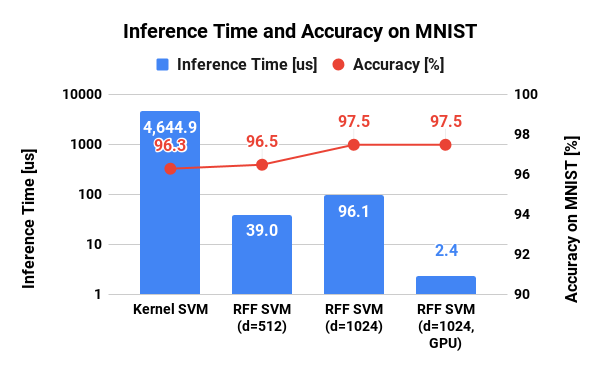

# Example of PyRFF module

This directory contains the example code for PyRFF module.

## Regression using Random Fourier Features

An example for regression using Random Fourier Features.
See [README.md](./rff_regression/README.md) for more details.

  

## Support Vector Classification using Random Fourier Features

An example of support vector classification for [MNIST](http://yann.lecun.com/exdb/mnist/) dataset using Random Fourier Features.
See [README.md](./rff_svc_for_mnist/README.md) for more details.

  

## Support Vector Classification using Random Fourier Features with Batch Learning

An example of support vector classification with batch learning for [MNIST](http://yann.lecun.com/exdb/mnist/) dataset using Random Fourier Features.
See [README.md](./rff_batch_svc_for_mnist/README.md) for more details.

However, you do not need to pay much attention for this example because
[non-batch learning approach](./rff_svc_for_mnist/README.md)
(i.e. usual SVC training using all dataset) now shows more higher performance than the batch learning approach.

