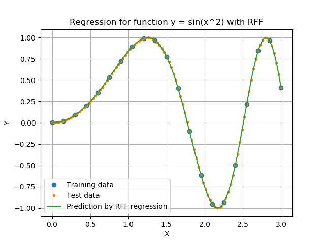
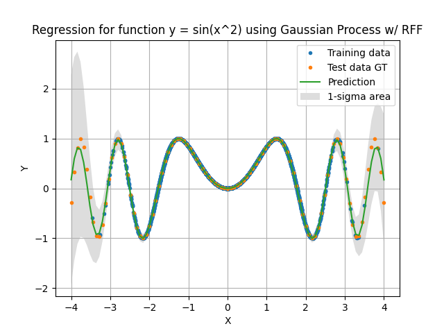
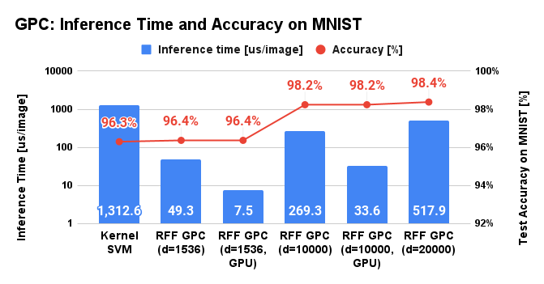
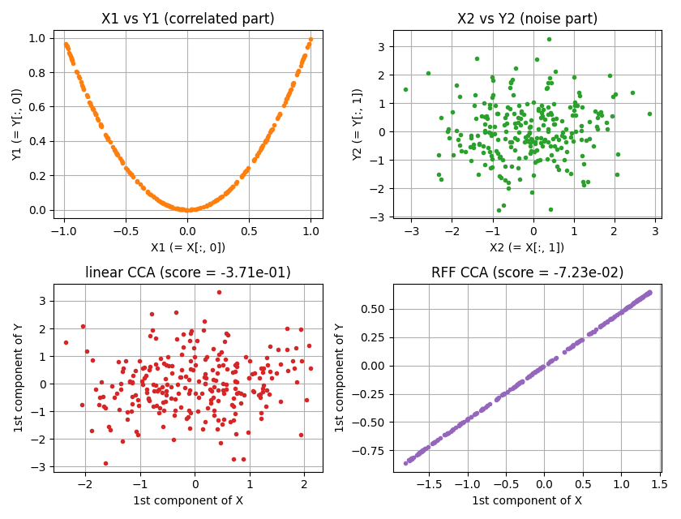
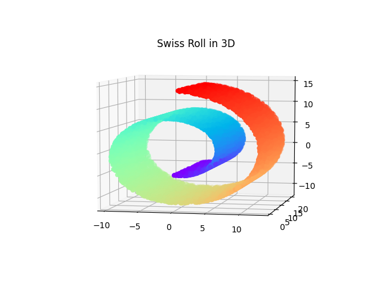
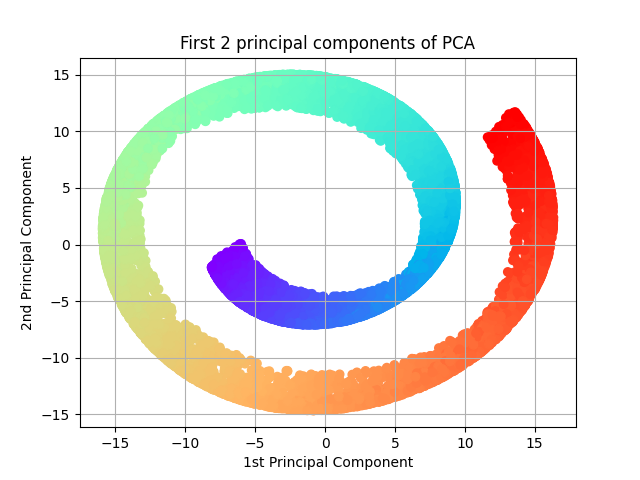
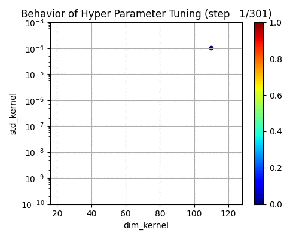
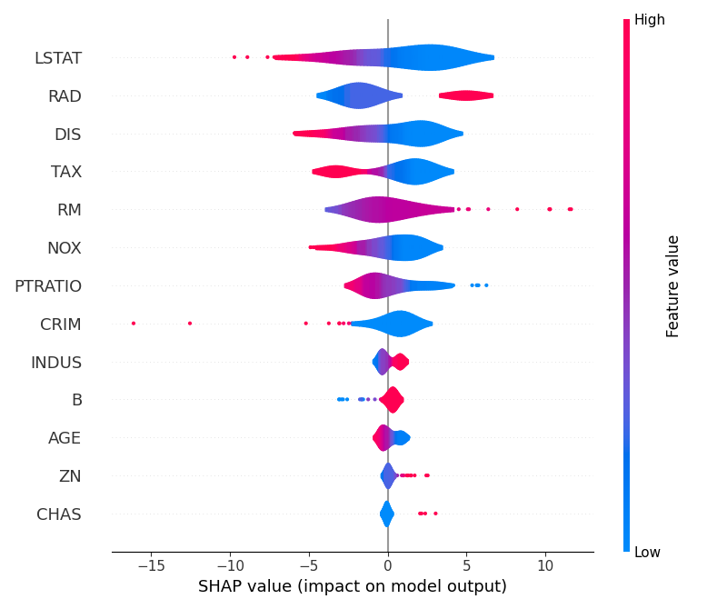
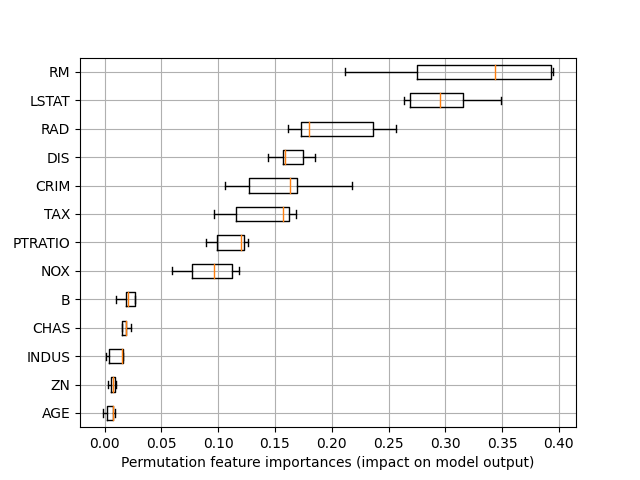

# Example of RFFLearn module

This directory contains the example code for the `rfflearn.cpu` and `rfflearn.gpu` module.

## Least square regression with random Fourier features

An example of regression with random Fourier features.
See [README.md](./least_square_regression/README.md) for more details.

  

## Gaussian process regression with random Fourier features

An example of Gaussian process regression with random Fourier features.
See [README.md](./gpr_sparse_data/README.md) for more details.

  

## Gaussian process classification with random Fourier features

An example of the Gaussian process classification with random Fourier features.
See [README.md](./gpc_for_mnist/README.md) for more details.

  

## Support vector classification with random Fourier features

An example of support vector classification for [MNIST](http://yann.lecun.com/exdb/mnist/) dataset with random Fourier features.
See [README.md](./svc_for_mnist/README.md) for more details.

  

## Canonical correlation analysis with random Fourier features

An example of canonical correlation analysis with random Fourier features.
See [README.md](./cca_for_artificial_data/README.md) for more details.

  

## Principal component analysis with random Fourier features

An example of principal component analysis for swiss roll dataset with random Fourier features.
See [README.md](./pca_for_swissroll/README.md) for more details.

  
  

## Automatic hyper parameter tuning using Optuna

An example of automatic hyper parameter tuning functions that uses [Optuna](https://optuna.org/) as a backend.
See [README.md](./optuna_for_boston_housing/README.md) for more details.

  

## Feature importance of trained model and visualization of the importance

An example of automatic hyper parameter tuning functions that uses [Optuna](https://optuna.org/) as a backend.
See [README.md](./feature_importances_for_boston_housing/README.md) for more details.

  
  

## Support vector classification with random Fourier features with batch learning

An example of support vector classification with batch learning for [MNIST](http://yann.lecun.com/exdb/mnist/) dataset with random Fourier features.
See [README.md](./svc_for_mnist_batch/README.md) for more details.

However, you do not need to pay much attention to this example because
[non-batch learning approach](./svc_for_mnist/README.md)
(i.e. usual SVC training using all dataset) now shows higher performance than the batch learning approach.
