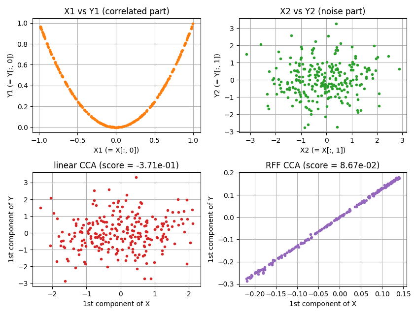
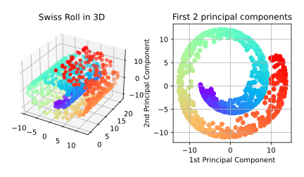
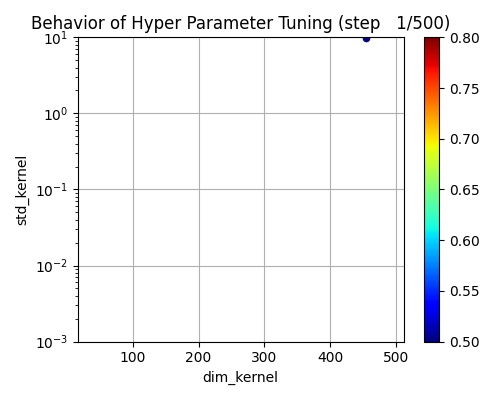
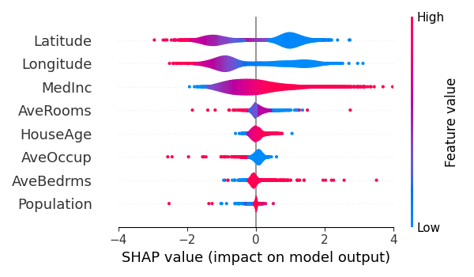
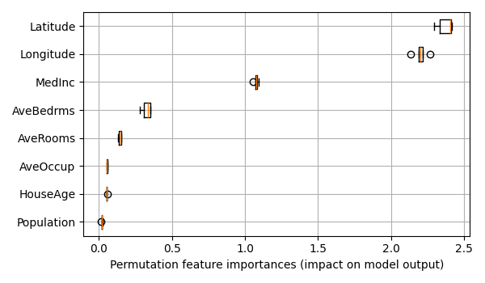

Example of rfflearn Module
====================================================================================================

This directory contains the example code for the `rfflearn.cpu` and `rfflearn.gpu` module.

Least square regression with random Fourier features
----------------------------------------------------------------------------------------------------

An example of regression with random Fourier features.
See [README.md](./least_square_regression/README.md) for more details.

  

Gaussian process regression with random Fourier features
----------------------------------------------------------------------------------------------------

An example of Gaussian process regression with random Fourier features.
See [README.md](./gpr_sparse_data/README.md) for more details.

  

Gaussian process classification with random Fourier features
----------------------------------------------------------------------------------------------------

An example of the Gaussian process classification with random Fourier features.
See [README.md](./gpc_for_mnist/README.md) for more details.

  

Support vector classification with random Fourier features
----------------------------------------------------------------------------------------------------

An example of support vector classification for [MNIST](http://yann.lecun.com/exdb/mnist/) dataset
with random Fourier features. See [README.md](./svc_for_mnist/README.md) for more details.

  

Canonical correlation analysis with random Fourier features
----------------------------------------------------------------------------------------------------

An example of canonical correlation analysis with random Fourier features.
See [README.md](./cca_for_artificial_data/README.md) for more details.

  

Principal component analysis with random Fourier features
----------------------------------------------------------------------------------------------------

An example of principal component analysis for the swiss roll dataset with random Fourier features.
See [README.md](./pca_for_swissroll/README.md) for more details.

  

Automatic hyperparameter tuning using Optuna
----------------------------------------------------------------------------------------------------

An example of automatic hyperparameter tuning functions that uses [Optuna](https://optuna.org/)
as a backend. See [README.md](./optuna_for_california_housing/README.md) for more details.

  

Feature importance of trained model and visualization of the importance
----------------------------------------------------------------------------------------------------

An example of the computation of feature importance that uses
[scikit-learn](https://scikit-learn.org/) and [Optuna](https://optuna.org/) as backends.
See [README.md](./feature_importances_for_california_housing/README.md) for more details.

  
  

