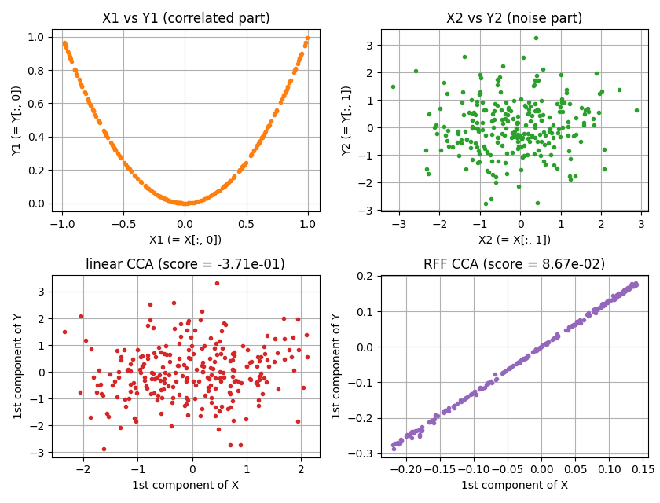

Canonical Correlation Analysis using Random Fourier Features
====================================================================================================

This directory provides examples of canonical correlation analysis with random Fourier features.

Results of canonical correlation analysis with RFF
----------------------------------------------------------------------------------------------------

The input data `X` and `Y` have shape `(number_of_samples, dimension) = (500, 2)`,
and the data is composed of 2 parts, correlated and noise part.
As shown in the following figure, `X[:, 0]` and `Y[:, 0]` have strong correlation,
however, `X[:, 1]` and `Y[:, 1]` are completely independent.
The linear CCA failed to find the correlation, but CCA with random Fourier features succeeded
because of its nonlinearity.

  

