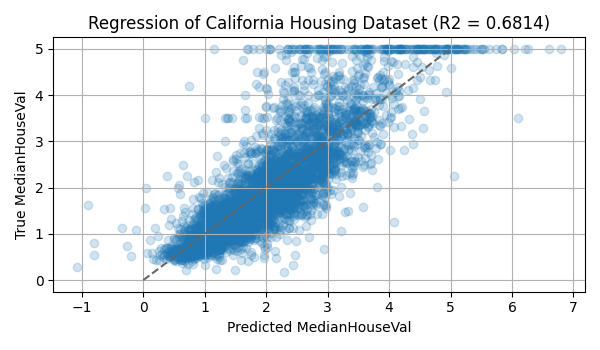

Feature Importance for California Housing Dataset
====================================================================================================

This directory provides an example of feature importance calculation and visualization
that is one of the typical data analysis procedures. In here, we build a model for
the California housing dataset and calculate the feature importance of the model.
The backend of the SHAP feature importance is [SHAP library](https://shap.readthedocs.io/en/latest/).

Results of feature importance
----------------------------------------------------------------------------------------------------

The following figures are result of regression results, SHAP importance, and permutation importance.

  
  
  

