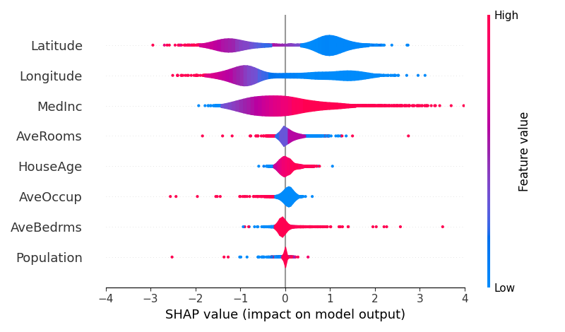

Feature Importance of Trained Model
====================================================================================================

This directory provides an example of feature importance calculation and visualization
that is one of the typical data analysis procedures. In here, we build a model for
the California housing dataset and calculate the feature importance of the model.
The backend of the SHAP feature importance is [SHAP library](https://shap.readthedocs.io/en/latest/).


Installation
----------------------------------------------------------------------------------------------------

See [this document](../../SETUP.md) for more details.

### Docker image (recommended)

```console
docker pull tiskw/pytorch:latest
cd PATH_TO_THE_ROOT_DIRECTORY_OF_THIS_REPO
docker run --rm -it -v `pwd`:/work -w /work -u `id -u`:`id -g` tiskw/pytorch:latest bash
cd examples/optuna_and_shap_for_boston_housing/
```

### Install on your environment (easier, but pollute your development environment)

```console
pip3 install docopt numpy scipy scikit-learn  # Necessary packages
pip3 install torch                            # Required only for GPU training/inference
pip3 install shap                             # Required for feature importance
```


Usage
----------------------------------------------------------------------------------------------------

The sample script `main_feature_importanves_for_boston_housing.py` provides an example of the procedure
to train a model and compute feature importances on the model using the California housing dataset.

```console
python3 main_feature_importanves_for_california_housing.py
```

The following figure shows the regression result of house price and the list of important features.

<div align="center">
  
  
  
</div>

### Training on GPU

Open the script file, replace `rfflearn.cpu` as `rfflean.gpu` and run the script again.
