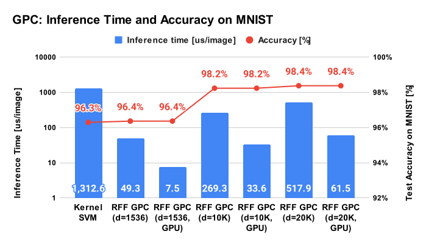

Gaussian Process Classifier using Random Fourier Features for MNIST Dataset
====================================================================================================

This directory provides an example of the Gaussian process classifier with random Fourier features
for the MNIST dataset. The notebook in this directory supports both CPU/GPU training.


Training script
----------------------------------------------------------------------------------------------------

The notebooks are easy to understand, but inconvenient for batch processing. This directory
contains a Python script that trains and evaluates a RFFSVC model.

```shell
python3 gpc_for_mnist.py --rtype rff --kdim 1024 --kstd 0.05 --estd 0.1
```


Results of Gaussian process classification with RFF
----------------------------------------------------------------------------------------------------

In the author's computing environment (CPU: Intel Core i5-9300H, RAM: 32GB, GPU: GeForce GTX1660Ti),
the author has got the following results:

| Method     | RFF dim | Device    | Training time (sec) | Inference time (us) | Score (%) | std\_kernel | std\_error |
|:----------:|:-------:|:---------:|:-------------------:|:-------------------:|:---------:|:----------:|:---------:|
| Kernel SVC | -       | CPU       |  47.63 sec          | 1312.6 us           | 96.30 %   | -          | -         |
| GPC w/ RFF | 1536    | CPU       |   3.76 sec          |   49.3 us           | 96.37 %   | 0.1        | 0.5       |
| GPC w/ RFF | 1536    | GTX1660Ti |      -              |   7.46 us           | 96.37 %   | 0.1        | 0.5       |
| GPC w/ RFF | 10000   | CPU       |  96.95 sec          |  269.3 us           | 98.24 %   | 0.1        | 0.5       |
| GPC w/ RFF | 10000   | GTX1660Ti |      -              |   33.6 us           | 98.24 %   | 0.1        | 0.5       |
| GPC w/ RFF | 20000   | CPU       | 516.19 sec          |  517.9 us           | 98.38 %   | 0.1        | 0.5       |
| GPC w/ RFF | 20000   | GTX1660Ti |      -              |   61.5 us           | 98.38 %   | 0.1        | 0.5       |

<div align="center">
  
</div>

### Notes

- The `score` in the above table means the test accuracy of the MNIST dataset and the `inference time`
  means the inference time for one image.
- Commonly used techniques like data normalization and dimension reduction using PCA are also used
  in the above analysis. See comments in the training script for details.
- The Score of RFF GPC is better than kernel SVC, moreover, the training/inference time of RFF GP
  is amazingly faster.

