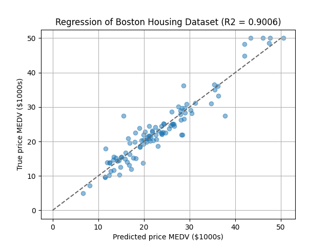

# Gaussian Process Regression using Random Fourier Features

This directory provides examples of Gaussian process regression with random Fourier features.

The training script in this directory supports both CPU/GPU training.
For the GPU training, you need to install Tensorflow 2.x (Tensorflow 1.x is not supported).


## Installation

See [this document](https://tiskw.gitbook.io/rfflearn/tutorial#setting-up) for more details.

### Install on your environment (easier, but pollute your development environment)

```console
$ pip3 install docopt numpy scipy scikit-learn  # Necessary packages
$ pip3 install tensorflow-gpu                   # Required only for GPU training/inference
$ pip3 install optuna                           # Required only for hyper parameter tuning
```

### Docker image (recommended)

```console
$ docker pull tiskw/tensorflow:2021-01-08
$ cd PATH_TO_THE_ROOT_DIRECTORY_OF_THIS_REPO
$ docker run --rm -it --gpus=all -v `pwd`:/work -w /work -u `id -u`:`id -g` tiskw/tensorflow:2021-01-08 bash
$ cd examples/gpr_sparse_data/
```
If you don't need GPU support, the option `--gpus=all` is not necessary.


## Usage

### Simple example of Gaussian process regression

You can run the example code by the following command:

```console
$ python3 main_gpr_sparse_data.py kernel  # Normal GP regression
$ python3 main_gpr_sparse_data.py rff     # RFF GP regression
$ python3 main_gpr_sparse_data.py orf     # ORF GP regression
```

The following figure shows regression results for the function y = sin(x^2) with RFF where the dimension of RFF is 16.
RFF makes the training and inference speed much faster than the usual Gaussian process.
I would like to specially mention that the inference time of the RFF GPR is almost constant while the inference time of normal GPR grow rapidly.
The following table is a summary of training and inference speed under my environment (Intel Core i7-8665U@1.90GHz, 4GB RAM).

| Number of trainig samples | Number of test samples  | Training/Inference Time of Normal GPR | Training/Inference Time of RFFGPR |
| :-----------------------: | :---------------------: | :-----------------------------------: | :-------------------------------: |
|   1,000                   | 1,000                   | 1.50 [s] / 18.9 [us]                  | 0.156 ms / 0.670 [us/sample]      |
|   5,000                   | 1,000                   | 98.3 [s] /  105 [us]                  |  6.14 ms / 0.921 [us/sample]      |
|  10,000                   | 1,000                   |  468 [s] / 1.87 [ms]                  |  11.3 ms / 0.700 [us/sample]      |
|  50,000                   | 1,000                   |    - [s] /    - [s]                   |  47.1 ms / 0.929 [us/sample]      |
| 100,000                   | 1,000                   |    - [s] /    - [s]                   |  93.5 ms / 0.852 [us/sample]      |

<div align="center">
  
</div>

### Hyper parameter tuning using Optuna

The script file `main_rff_regression_optuna.py` provides an example of hyper parameter tuning using Optuna.
We used the famouse Boston Housing dataset and tryed to predict the median of price (`MEDV`).

```console
$ python3 main_rff_gpr_optuna.py
```

The following figure shows regression results for the the Boston Housing dataset where hyper parameters were tuned by Optuna.

<div align="center">
  
</div>

### Training on GPU

Open the script file, replace `rfflearn.cpu` as `rfflean.gpu` and run the script again.

