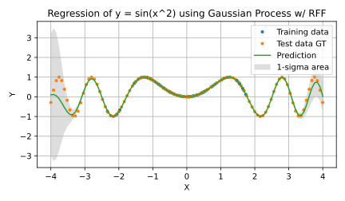

Gaussian Process Regression using Random Fourier Features
====================================================================================================

This directory provides examples of Gaussian process regression with random Fourier features.

Results of Gaussian process regressor on the artificial sparse data
----------------------------------------------------------------------------------------------------

### A simple example of Gaussian process regression

The following figure shows regression results for the function y = sin(x^2) with RFF where
the dimension of RFF is 16. RFF makes the training and inference speed much faster than the usual
Gaussian process. I would like to specially mention that the inference time of the RFF GPR is almost
constant while the inference time of normal GPR grow rapidly. The following table is a summary of
training and inference speed under my environment (Intel Core i7-8665U@1.90GHz, 4GB RAM).

| Number of training samples | Number of test samples  | Training/Inference Time of Normal GPR | Training/Inference Time of RFFGPR |
|:--------------------------:|:-----------------------:|:-------------------------------------:|:---------------------------------:|
|   1,000                    | 1,000                   | 1.50 [s] / 18.9 [us]                  | 0.156 ms / 0.670 [us/sample]      |
|   5,000                    | 1,000                   | 98.3 [s] /  105 [us]                  |  6.14 ms / 0.921 [us/sample]      |
|  10,000                    | 1,000                   |  468 [s] / 1.87 [ms]                  |  11.3 ms / 0.700 [us/sample]      |
|  50,000                    | 1,000                   |    - [s] /    - [s]                   |  47.1 ms / 0.929 [us/sample]      |
| 100,000                    | 1,000                   |    - [s] /    - [s]                   |  93.5 ms / 0.852 [us/sample]      |

  

### Re-sampling from the predicted mean and covariance

The Gaussian process model can predict both mean and covariance from training data, therefore,
you can re-sample data points from the normal distribution using the predicted mean vector
and covariance matrix (e.g. `np.random.multivariate_normal`).

  

Gratitude
----------------------------------------------------------------------------------------------------

- I'm deeply grateful to [Dr. Sebastian Khan](https://github.com/Cyberface).
  The re-sampling code in this Python script highly depends on his notebook which he shared with me
  in [the Issue 7](https://github.com/tiskw/random-fourier-features/issues/7).
