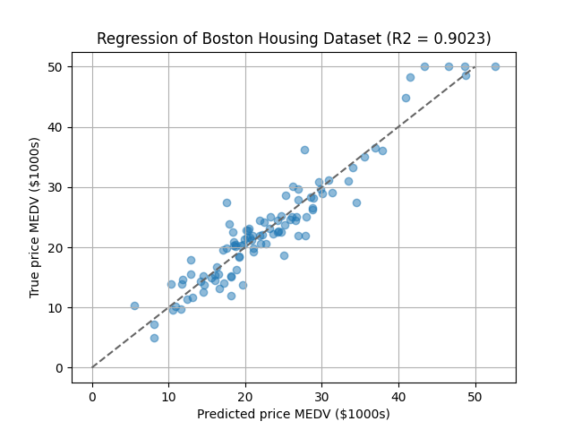

# Least Square Regression using Random Fourier Features

This directory provides examples of regression with random Fourier features.


## Installation

See [this document](https://tiskw.gitbook.io/rfflearn/tutorial#setting-up) for more details.

### Install on your environment (easier, but pollute your development environment)

```console
$ pip3 install docopt numpy scipy scikit-learn  # Necessary packages
$ pip3 install optuna                           # Required only for hyper parameter tuning
```

### Docker image (recommended)

```console
$ docker pull tiskw/tensorflow:2021-01-08
$ cd PATH_TO_THE_ROOT_DIRECTORY_OF_THIS_REPO
$ docker run --rm -it -v `pwd`:/work -w /work -u `id -u`:`id -g` tiskw/tensorflow:2021-01-08 bash
$ cd examples/least_square_regression/
```


## Usage

### Simple examplem of regression

The script file `main_rff_regression_plain.py` provides an example of the simplest usage of `rfflearn.RFFRegression`.
The target function in this script is y = sin(x^2) which is tough for linear regression to be fit well.

```console
$ python3 main_rff_regression_plain.py
```

The following figure shows regression results for the function y = sin(x^2) where the dimension of RFF is 16.

<div align="center">
  
</div>

### Hyper parameter tuning with Optuna

The script file `main_rff_regression_optuna.py` provides an example of hyper parameter tuning using Optuna.
We used the famouse Boston Housing dataset and tryed to predict the median of price (`MEDV`).

```console
$ python3 main_rff_regression_optuna.py
```

The following figure shows regression results for the the Boston Housing dataset where hyper parameters were tuned by Optuna.

<div align="center">
  
</div>

### Training on GPU

Open the script file, replace `rfflearn.cpu` as `rfflean.gpu` and run the script again.

