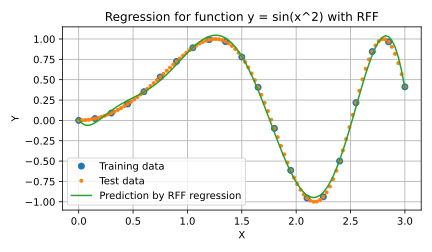

Least Square Regression using Random Fourier Features
====================================================================================================

This directory provides examples of kernel regression with random Fourier features.

Results of regression
----------------------------------------------------------------------------------------------------

### A simple example of regression

The following figure shows regression results for the function y = sin(x^2) where the dimension
of RFF is 16.

  

