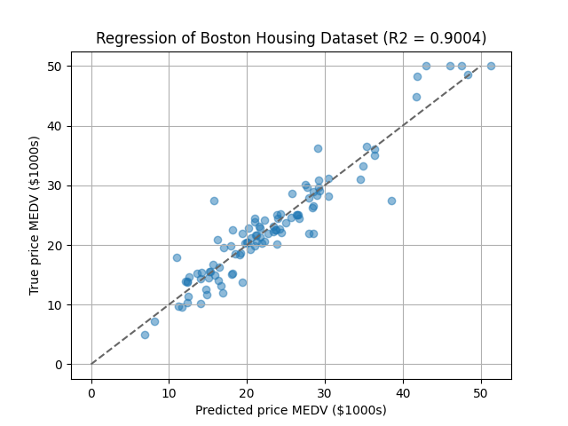
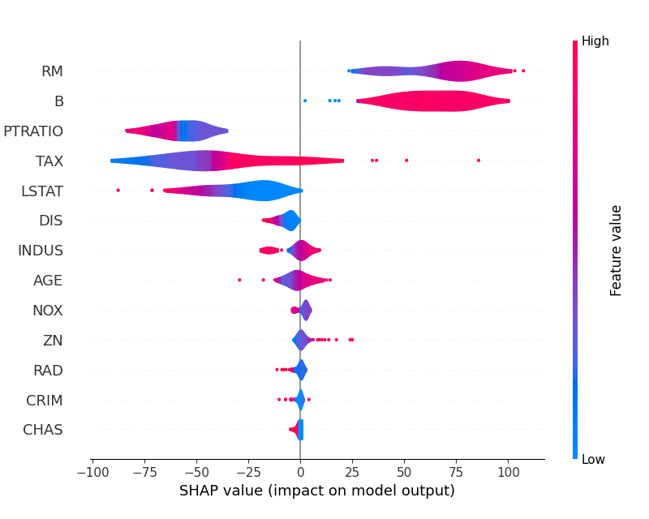

# Auto Hyper Parameter Tuning and Feature Importance

This directory provides an example of automatic hyper parameter tuning
and feature importance calculation that is one of the typical data analysis procedure.
In here, we build a model for the Boston house-price dataset using automatic hyper parameter tuning
and calculate the feature importances.
The backend of the automatic hyper parameter tuning is [Optuna](https://optuna.org/),
and feature importance is [SHAP](https://shap.readthedocs.io/en/latest/).


## Installation

See [this document](https://tiskw.gitbook.io/rfflearn/tutorial#setting-up) for more details.

### Install on your environment (easier, but pollute your development environment)

```console
$ pip3 install docopt numpy scipy scikit-learn  # Necessary packages
$ pip3 install optuna                           # Required for hyper parameter tuning
$ pip3 install shap                             # Required for feature importance
```

### Docker image (recommended)

```console
$ docker pull tiskw/tensorflow:2021-01-08
$ cd PATH_TO_THE_ROOT_DIRECTORY_OF_THIS_REPO
$ docker run --rm -it -v `pwd`:/work -w /work -u `id -u`:`id -g` tiskw/tensorflow:2021-01-08 bash
$ cd examples/optuna_and_shap_for_boston_housing/
```


## Usage

One of the tipycal data analysis procedure is automatic hyper parameter tuning of a model and feature importance calculation.
The sample script `main_optuna_and_shap_for_boston_housing.py` provides an example of the procedure using the Boston house-price dataset.

```console
$ python3 main_optuna_and_shap_for_boston_housing.py
```

The following figure shows regression result of house price and the list of important features with violin plot.

<div align="center">
  
  
</div>

### Training on GPU

Open the script file, replace `rfflearn.cpu` as `rfflean.gpu` and run the script again.
