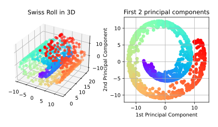

Principal Component Analysis using Random Fourier Features
====================================================================================================

This Python script provides an example of PCA with Random Fourier Features (RFFPCA).

Results of principal component analysis using random Fourier features
----------------------------------------------------------------------------------------------------

The following figure shows the input data (10,000 points of swiss roll) and results of RFF PCA.

  

### Computational time

In my computing environment (CPU: Intl Core i5 5250U, RAM: 4GB), I've got the following results:

| Method                | Training time (sec) |
|:---------------------:|:-------------------:|
| Kernel PCA            | 6.01 sec            |
| RFF PCA   d = 1024 | 0.88 sec            |

