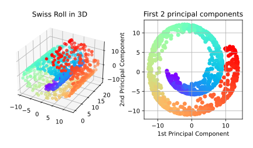

Principal Component Analysis using Random Fourier Features
====================================================================================================

This Python script provides an example of PCA with Random Fourier Features (RFF PCA).
Our module for Random Fourier Features (PyRFFF.py) needs scikit-learn as a backend of PCA solver,
therefore you need to install scikit-learn.


Installation
----------------------------------------------------------------------------------------------------

See [this document](../../SETUP.md) for more details.

### Docker image (recommended)

```console
docker pull tiskw/pytorch:latest
cd PATH_TO_THE_ROOT_DIRECTORY_OF_THIS_REPO
docker run --rm -it -v `pwd`:/work -w /work -u `id -u`:`id -g` tiskw/pytorch:latest bash
cd examples/gpr_sparse_data/
```

### Install on your environment (easier, but pollute your development environment)

```console
pip3 install docopt numpy scipy scikit-learn  # Necessary packages
pip3 install torch                            # Required only for GPU training/inference
```

Usage
----------------------------------------------------------------------------------------------------

```console
python3 main_pca_for_swissroll.py rff     # RFF PCA
python3 main_pca_for_swissroll.py kernel  # Kernel PCA
```

### Results of principal component analysis using random Fourier features

The following figure shows the input data (10,000 points of swiss roll) and results of RFF PCA.

<div align="center">
  
</div>


### Computation time

In my computing environment (CPU: Intl Core i5 5250U, RAM: 4GB), I've got the following results:

| Method                | Training time (sec) |
| :------------------:  | :-----------------: |
| Kernel PCA            | 6.01 sec            |
| RFF PCA <br> d = 1024 | 0.88 sec            |

### Training on GPU

Open the script file, replace `rfflearn.cpu` as `rfflean.gpu` and run the script again.
