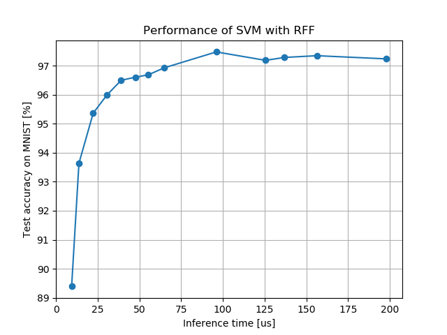

Random Fourier Features: RFF and ORF for MNIST dataset
====

This python script provide an example for RFF/ORF SVC with MNIST dataset.
Our module for random fourier features (PyRFFF.py) needs scikit-learn as a backend of SVM solver therefore you need to install scikit-learn.

## Preparation

If you don't have scikit-learn, please run the following as root to install it:

    # pip3 install scikit-learn

Also, you need to download and convert MNIST data before running sample code by the following command:

    $ cd ../../data
    $ python3 download_and_convert_mnist.py

Original MNIST data will be downloaded automatically and converted to .npy file.

## Usage

After generating MNIST .npy files, run sample script by the following command:

    $ python3 sample_rff_batch_svc_for_mnist.py kernel   # Run kernel SVC
    $ python3 sample_rff_batch_svc_for_mnist.py rff      # Run SVC with RFF
    $ python3 sample_rff_batch_svc_for_mnist.py orf      # Run SVC with ORF

Parameters of each method are hard-corded in the Python script.

## Results of Support Vector Classification with RFF

In my computing environment (CPU: Intl Core i5 5250U, RAM: 4GB), I've got the following results:

| Method                   | Training time (sec) | Inference time (us) | Score (%) |
| :---------------------:  | :-----------------: | :-----------------: | :-------: |
| Kernel SVM               | 177.8 sec           | 4644.9 us           | 96.3 %    |
| SVM w/ RFF   d = 512  | 126.6 sec           | 39.0 us             | 96.5 %    |
| SVM w/ RFF   d = 1024 | 226.7 sec           | 96.1 us             | 97.5 %    |

Where score means test accuracy of MNIST dataset.

Commonly used techniques like data normalization and dimention reduction using PCA is also used in the above analysis.
See comments in the Python script for details.

Score of RFF is slightly better than kernel SVM, moreover, prediction time of RFF and ORF is amazingly faster.
On the otherhand, learning time of RFF can be longer than kernel SVM if dimention of RFF is large.

The following figures shows a tradeoff between accuracy and inference time of RFF.

  

