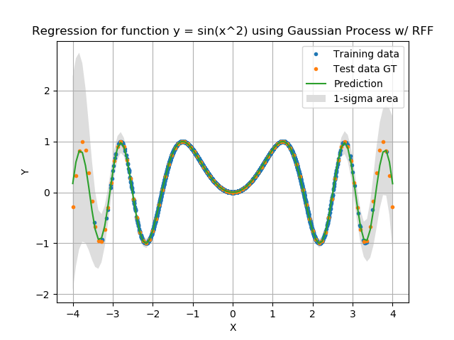

Random Fourier Features: Regression using Gaussian Process
====

Gaussian Process can be accelerated by RFF technique.
This python script provides an example of Gaussian Process regression with Random Fourier Features.
Our module for Gaussian Process (RFFGaussianProcess) needs numpy and docopt.


## Usage

If you don't have docopt-learn, please run one of the following commands as root to install it:

```console
$ pip3 install docopt         # using pip
$ apt install python3-docopt  # using apt
```

You can run the example code by the following command:

```console
$ python3 main_gp_regression.py
```

## Results of Gaussian Process Regression with RFF

The following figure shows regression results for the function y = sin(x^2) with RFF where the dimension of RFF is 16.
RFF makes the training and inference speed much faster than usual Gaussian Process.
The following table is a summary of training and inference speed under my own environment.

| Number of trainig samples | Training time | Inference time |
| :-----------------------: | :-----------: | :------------: |
|   1,000                   | 1.48 ms       | 1.28 us        |
|   5,000                   | 6.14 ms       | 1.25 us        |
|  10,000                   | 11.2 ms       | 1.36 us        |
|  50,000                   | 70.5 ms       | 1.38 us        |
| 100,000                   |  142 ms       | 1.70 us        |

<div align="center">
  
</div>

