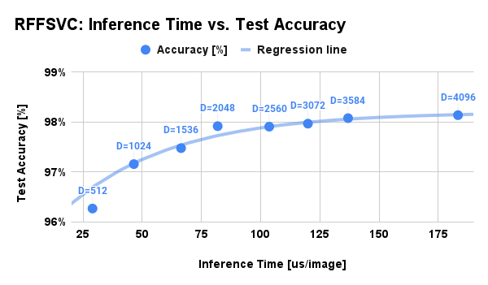

Support Vector Classifier using Random Fourier Features for MNIST dataset
====================================================================================================

This directory provides an example of the support vector classifier with random Fourier features
for the MNIST dataset.

The training script in this directory supports both CPU/GPU training.
For the GPU training and inference, you need [PyTorch](https://pytorch.org/).


Installation
----------------------------------------------------------------------------------------------------

See [this document](../..SETUP.md) for more details.

### Install on your environment (easier, but pollute your development environment)

```console
pip3 install docopt numpy scipy scikit-learn  # Necessary packages
pip3 install torch                            # Required only for GPU training/inference
pip3 install optuna                           # Required only for hyperparameter tuning
```

### Docker image (recommended)

```console
docker pull tiskw/pytorch:latest
cd PATH_TO_THE_ROOT_DIRECTORY_OF_THIS_REPO
docker run --rm -it --gpus=all -v `pwd`:/work -w /work -u `id -u`:`id -g` tiskw/pytorch:latest bash
cd examples/gpr_sparse_data/
```

If you don't need GPU support, the option `--gpus=all` is not necessary.


Dataset preparation
----------------------------------------------------------------------------------------------------

You need to download and convert MNIST data before running the training code.
Please run the following commands:

```console
cd ../../dataset/mnist
python3 download_and_convert_mnist.py
```

The MNIST dataset will be automatically downloaded, converted to `.npy` file
and saved under `dataset/mnist/` directory.


Training
----------------------------------------------------------------------------------------------------

### Training (on CPU)

After generating MNIST .npy files, run sample scripts by the following command:

```console
python3 train_rff_svc_for_mnist.py kernel           # Run kernel SVC training
python3 train_rff_svc_for_mnist.py cpu --rtype rff  # Run RFFSVC training on CPU
```

Default hyperparameter settings are recommended values, however, you can change the parameters
by the command options. The above command will generate `result.pickle` in which a trained model,
PCA matrix, and command arguments are stored. See `train_rff_svc_for_mnist.py --help` for details.

### Training on GPU

This module contains a beta version of GPU training implementation.
You can try the GPU training by the following command:

```console
$ python3 train_rff_svc_for_mnist.py gpu --rtype rff  # Run kernel SVC training on GPU
```


Inference
----------------------------------------------------------------------------------------------------

You can run inference by the following command:

```console
python3 valid_rff_svc_for_mnist.py cpu  # Inference on CPU using scikit-learn
python3 valid_rff_svc_for_mnist.py gpu  # Inference on GPU using PyTorch
```

Note that run inference of GPU-trained model on CPU is not supported. Supported combinations are:
- trained on CPU, inference on CPU,
- trained on CPU, inference on GPU,
- trained on GPU, inference on GPU.


Results of support vector classification with RFF
----------------------------------------------------------------------------------------------------

I've got the following results on my computing environment
(CPU: Intel Core i5-9300H, RAM: 32GB, GPU: GeForce GTX1660Ti):

| Method     | Dimension of RFF  | Training time [sec] | Inference time [us] | Score [%]  |
|:----------:|:-----------------:|:-------------------:|:-------------------:|:----------:|
| Kernel SVM | -                 |  47.6 [sec]         | 1312.6 [us]         | 96.30 [%]  |
| SVM w/ RFF | 640               |  76.7 [sec]         |   33.6 [us]         | 96.39 [%]  |
| SVM w/ RFF | 1024              | 101.9 [sec]         |   46.5 [us]         | 97.16 [%]  |
| SVM w/ RFF | 4096              | 442.4 [sec]         |  183.4 [us]         | 98.14 [%]  |

As for inference using GPU, I've got the following result:

| Method     | Dimension of RFF | Device    | Batch size | Inference time (us) | Score [%] |
|:----------:|:----------------:|:---------:|:----------:|:-------------------:|:---------:|
| SVM w/ RFF | 640              | GTX1660Ti | 2,000      | 1.11 [us]           | 96.39 [%] |
| SVM w/ RFF | 1024             | GTX1660Ti | 2,000      | 1.33 [us]           | 97.16 [%] |
| SVM w/ RFF | 4096             | GTX1660Ti | 2,000      | 2.62 [us]           | 98.14 [%] |

<div align="center">
  
</div>

### Notes

- Score means test accuracy of the MNIST dataset and inference time means inference time for one image.
- Now the GPU training does not show enough higher performance than the CPU training,
  but it's worth trying if you want faster training, especially on higher RFF dimensions
  than 1024 or a huge training dataset.
- Commonly used techniques like data normalization and dimension reduction using PCA are also used
  in the above analysis. See comments in the Python script for details.
- The Score of RFF is slightly better than kernel SVM, moreover, the inference time of RFF is
  amazingly faster. On the other hand, the learning time of RFF can be longer than kernel SVM
  if the dimension of RFF is large.
- The following figure shows a tradeoff between the accuracy and inference time of RFF.

<div align="center">
  
</div>


Bayesian parameter search using Optuna
----------------------------------------------------------------------------------------------------

You can automatically search the hyperparameters `dim_kernel` and `std_kernel` using Optuna
by the following command:

```console
python3 train_rff_svc_for_mnist_optuna.py
```

Note that the above command may take a long time.
