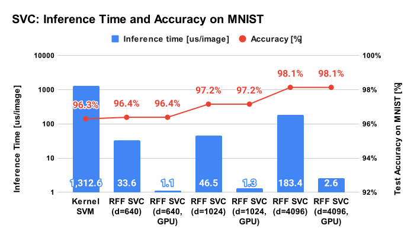
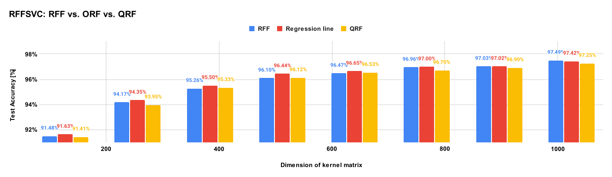

Support Vector Classifier using Random Fourier Features for MNIST dataset
====================================================================================================

This directory provides an example of the support vector classifier with random Fourier features
for the MNIST dataset. The notebook in this directory supports both CPU/GPU training.


Training script
----------------------------------------------------------------------------------------------------

The notebooks are easy to understand, but inconvenient for batch processing. This directory
contains a Python script that trains and evaluates a RFFSVC model.

```shell
python3 svc_for_mnist.py --rtype rff --kdim 1024 --kstd 0.05
```


Results of support vector classification with RFF
----------------------------------------------------------------------------------------------------

I've got the following results on my computing environment
(CPU: Intel Core i5-9300H, RAM: 32GB, GPU: GeForce GTX1660Ti):

| Method     | Dimension of RFF  | Training time [sec] | Inference time [us] | Score [%]  |
|:----------:|:-----------------:|:-------------------:|:-------------------:|:----------:|
| Kernel SVM | -                 |  47.6 [sec]         | 1312.6 [us]         | 96.30 [%]  |
| SVM w/ RFF | 640               |  76.7 [sec]         |   33.6 [us]         | 96.39 [%]  |
| SVM w/ RFF | 1024              | 101.9 [sec]         |   46.5 [us]         | 97.16 [%]  |
| SVM w/ RFF | 4096              | 442.4 [sec]         |  183.4 [us]         | 98.14 [%]  |

As for inference using GPU, I've got the following result:

| Method     | Dimension of RFF | Device    | Batch size | Inference time (us) | Score [%] |
|:----------:|:----------------:|:---------:|:----------:|:-------------------:|:---------:|
| SVM w/ RFF | 640              | GTX1660Ti | 2,000      | 1.11 [us]           | 96.39 [%] |
| SVM w/ RFF | 1024             | GTX1660Ti | 2,000      | 1.33 [us]           | 97.16 [%] |
| SVM w/ RFF | 4096             | GTX1660Ti | 2,000      | 2.62 [us]           | 98.14 [%] |

<div align="center">
  
</div>

### Notes

- Score means test accuracy of the MNIST dataset and inference time means inference time for one image.
- Now the GPU training does not show enough higher performance than the CPU training,
  but it's worth trying if you want faster training, especially on higher RFF dimensions
  than 1024 or a huge training dataset.
- Commonly used techniques like data normalization and dimension reduction using PCA are also used
  in the above analysis. See comments in the Python script for details.
- The Score of RFF is slightly better than kernel SVM, moreover, the inference time of RFF is
  amazingly faster. On the other hand, the learning time of RFF can be longer than kernel SVM
  if the dimension of RFF is large.
- The following figure shows a tradeoff between the accuracy and inference time of RFF.

<div align="center">
  
</div>


RFF vs. ORF vs. QRF
----------------------------------------------------------------------------------------------------

The following figure is the comparison of RFF, ORF, and QRF on the MNIST dataset.
The author observed no significant difference in these methods, therefore,
the author thinks users can choose whichever method they prefer.

<div align="center">
  
</div>

